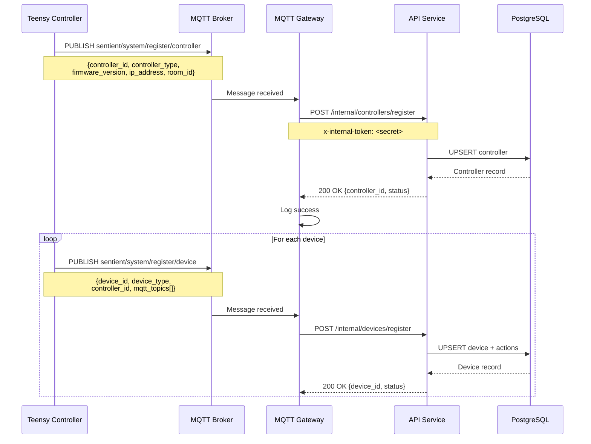
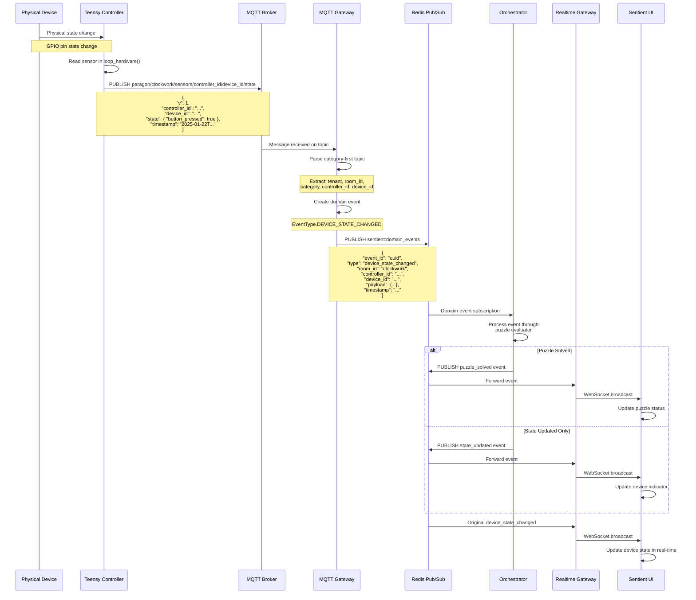
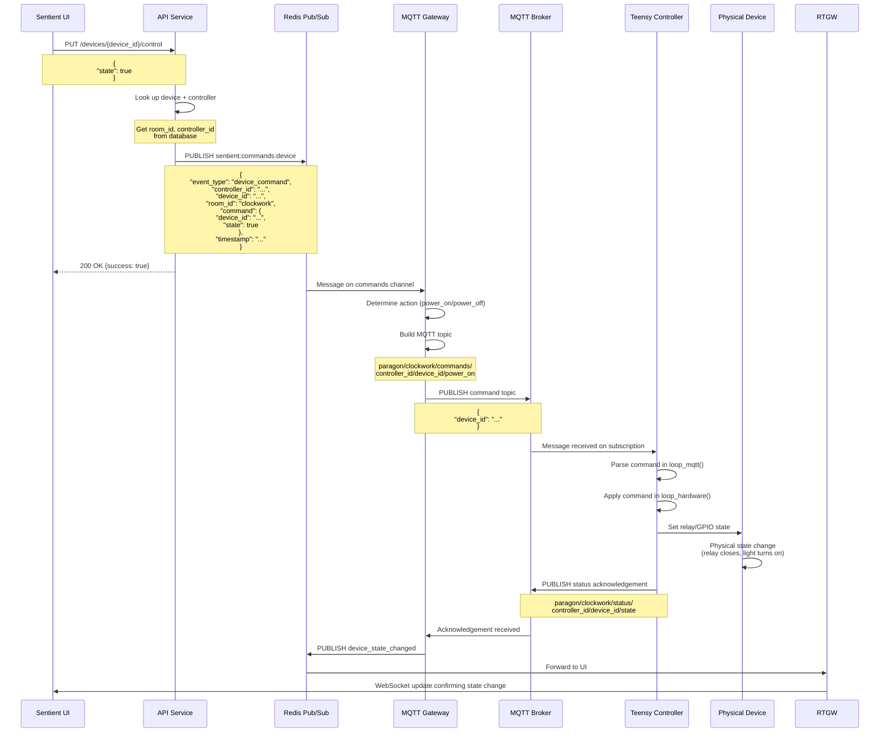
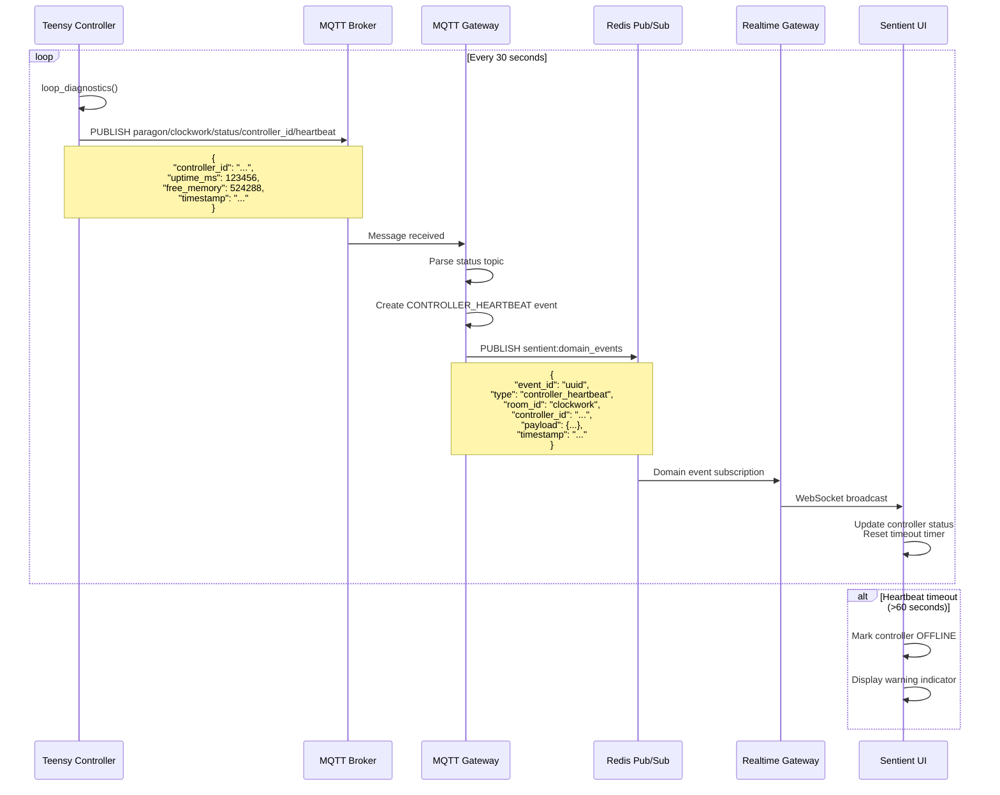
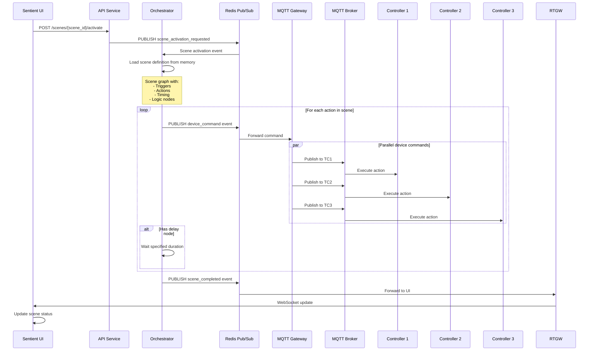
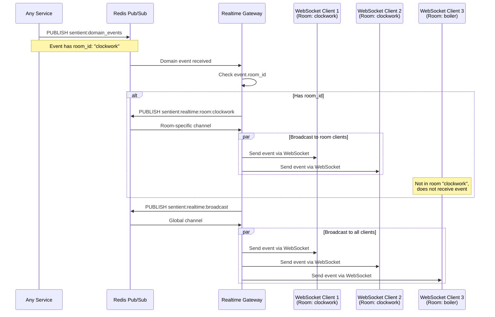

# Sentient Engine – Data & Message Flow Architecture

**Version:** 1.0  
**Date:** 2025-01-22  
**Purpose:** Comprehensive visualization and documentation of data and message flow through the Sentient system

---

## System Overview

Sentient Engine is a real-time theatrical control platform that orchestrates escape room hardware through event-driven architecture. Data flows through multiple pathways:

1. **Hardware → Cloud (Telemetry)**
2. **Cloud → Hardware (Commands)**
3. **Service-to-Service (Domain Events)**
4. **Cloud → UI (Real-time Updates)**
5. **UI → Cloud (Control Actions)**

---

## High-Level Data Flow Diagram

```mermaid
flowchart TB
    subgraph Hardware["🔧 Hardware Layer"]
        Teensy["Teensy 4.1 Controllers<br/>(I/O, Sensors, Actuators)"]
        Pi["Raspberry Pi Controllers<br/>(Media, Complex Logic)"]
        ESP["ESP32 Controllers<br/>(WiFi Devices)"]
        Devices["Physical Devices<br/>(Locks, Lights, Sensors, Motors)"]
    end

    subgraph Messaging["📡 Messaging Infrastructure"]
        MQTT["Mosquitto MQTT Broker<br/>Port 1883<br/>Category-First Topics"]
        Redis["Redis Pub/Sub<br/>Port 6379<br/>Domain Events"]
    end

    subgraph Services["⚙️ Core Services"]
        MQTTGW["MQTT Gateway<br/>Translation Layer"]
        API["API Service<br/>REST + WebSocket<br/>Port 3001"]
        ORCH["Orchestrator Service<br/>Game Logic Engine"]
        RTGW["Realtime Gateway<br/>WebSocket Hub<br/>Port 3002"]
    end

    subgraph Data["💾 Data Layer"]
        PG[("PostgreSQL<br/>Port 5432<br/>Source of Truth")]
    end

    subgraph UI["🖥️ User Interfaces"]
        SentientUI["Sentient UI<br/>(React/Vite)<br/>Admin + GM Console"]
    end

    %% Hardware to MQTT
    Teensy -->|"MQTT Publish<br/>sensors/*<br/>status/*"| MQTT
    Pi -->|"MQTT Publish<br/>sensors/*<br/>status/*"| MQTT
    ESP -->|"MQTT Publish<br/>sensors/*<br/>status/*"| MQTT
    Devices -.->|Physical I/O| Teensy
    Devices -.->|Physical I/O| Pi
    Devices -.->|Physical I/O| ESP

    %% MQTT to Services
    MQTT <-->|"Subscribe/Publish<br/>All Topics"| MQTTGW

    %% MQTT Gateway Flow
    MQTTGW -->|"Publish<br/>Domain Events"| Redis
    MQTTGW -->|"Register Controllers<br/>Register Devices"| API
    Redis -->|"Subscribe<br/>Device Commands"| MQTTGW
    MQTTGW -->|"MQTT Publish<br/>commands/*"| MQTT

    %% Commands back to hardware
    MQTT -->|"MQTT Subscribe<br/>commands/*"| Teensy
    MQTT -->|"MQTT Subscribe<br/>commands/*"| Pi
    MQTT -->|"MQTT Subscribe<br/>commands/*"| ESP

    %% Orchestrator Flow
    Redis <-->|"Subscribe/Publish<br/>Domain Events"| ORCH
    ORCH <-->|"SQL Queries<br/>Game State"| PG

    %% API Service Flow
    API <-->|"CRUD Operations<br/>Prisma ORM"| PG
    API -->|"Publish<br/>Commands"| Redis

    %% Realtime Gateway Flow
    Redis -->|"Subscribe<br/>Domain Events"| RTGW
    RTGW -->|"WebSocket<br/>Broadcast"| SentientUI

    %% UI Flow
    SentientUI -->|"HTTP REST<br/>CRUD/Auth"| API
    SentientUI <-->|"WebSocket<br/>Live Updates"| RTGW
    SentientUI -->|"Device Commands"| API

    classDef hardware fill:#2a3f5f,stroke:#00d9ff,stroke-width:2px,color:#fff
    classDef messaging fill:#1a2332,stroke:#ffa832,stroke-width:2px,color:#fff
    classDef services fill:#1a2332,stroke:#00d9ff,stroke-width:2px,color:#fff
    classDef data fill:#2a1a32,stroke:#8b5cf6,stroke-width:2px,color:#fff
    classDef ui fill:#1a2332,stroke:#00d9ff,stroke-width:3px,color:#fff

    class Teensy,Pi,ESP,Devices hardware
    class MQTT,Redis messaging
    class MQTTGW,API,ORCH,RTGW services
    class PG data
    class SentientUI ui
```



---

## Detailed Flow Pathways

### 1. Controller Registration Flow (Startup)

**Trigger:** Controller boots and connects to MQTT broker



**Key Points:**

- Uses system-level topics: `sentient/system/register/*`
- Gateway validates and forwards to API
- API uses internal authentication token
- Both controllers and devices are idempotent (UPSERT operations)

---

### 2. Device State Change Flow (Sensor Input)

**Trigger:** Physical sensor state change (button press, door open, etc.)



**Key Points:**

- Category-first topics enable efficient filtering: `<tenant>/<room_id>/sensors/...`
- MQTT Gateway converts MQTT messages to domain events
- Domain events flow through Redis to all interested services
- Orchestrator applies game logic and emits higher-level events
- Realtime Gateway fans out to all connected UI clients
- Multiple subscription paths (global events + room-specific)

---

### 3. Device Command Flow (UI Control Action)

**Trigger:** User clicks power switch in Sentient UI



**Key Points:**

- Command path: UI → API → Redis → MQTT Gateway → MQTT → Controller
- API validates device exists and user has permission
- Redis decouples API from MQTT Gateway
- MQTT Gateway translates Redis commands to category-first MQTT topics
- Controller firmware acknowledges state changes
- Feedback loop confirms command execution to UI

---

### 4. Controller Heartbeat Flow

**Trigger:** Controller timer fires (typically every 5-30 seconds)



**Key Points:**

- Heartbeats use status category: `<tenant>/<room_id>/status/<controller_id>/heartbeat`
- Gateway converts to `CONTROLLER_HEARTBEAT` domain event
- UI tracks last heartbeat timestamp
- Timeout detection happens client-side
- Future: Orchestrator could trigger alerts on controller offline

---

### 5. Scene Execution Flow (Orchestrator-Driven)

**Trigger:** Game master activates a scene OR puzzle completion triggers scene transition



**Key Points:**

- Orchestrator maintains scene graph in memory
- Scene execution is sequential with delays
- Device commands can execute in parallel
- Scene transitions are event-driven
- Future: Scene editor in UI creates scene definitions stored in PostgreSQL

---

### 6. WebSocket Real-time Update Flow

**Trigger:** Any domain event published to Redis



**Key Points:**

- Realtime Gateway subscribes to all domain events
- Events are published to both room-specific and global channels
- Clients receive events based on their subscriptions
- WebSocket connections are authenticated with JWT on connection
- Connection management tracks rooms and sessions per client

---

## MQTT Topic Structure (Category-First Design)

### Topic Pattern

```
<tenant>/<room_id>/<category>/<controller_id>/<device_id>/<action_or_sensor>
```

### Categories

1. **commands/** - Commands sent TO controllers
2. **sensors/** - Sensor data FROM controllers
3. **status/** - Controller status (heartbeats, connection)

### Examples

```
# Device Commands (API → MQTT Gateway → Controllers)
paragon/clockwork/commands/power_control_upper_right/main_lighting_24v/power_on
paragon/clockwork/commands/gear_controller/gear_motor/rotate_cw
sentient/demo/commands/test_controller/relay_1/power_off

# Sensor Data (Controllers → MQTT Gateway → Domain Events)
paragon/clockwork/sensors/power_control_upper_right/main_lighting_24v/state
paragon/clockwork/sensors/crank_controller/position_sensor/angle
sentient/demo/sensors/test_controller/button_1/pressed

# Controller Status (Controllers → MQTT Gateway → Health Monitoring)
paragon/clockwork/status/power_control_upper_right/heartbeat
paragon/clockwork/status/gear_controller/connection
sentient/demo/status/test_controller/diagnostics
```

### System-Level Topics

```
# Registration (Controllers → MQTT Gateway → API)
sentient/system/register/controller
sentient/system/register/device
```

### Benefits of Category-First Structure

1. **Efficient Wildcard Subscriptions:**
   - `paragon/+/commands/#` - All commands across all Paragon rooms
   - `+/+/sensors/#` - All sensor data across all tenants/rooms
   - `paragon/clockwork/status/#` - All status for one room

2. **Security & ACL:**
   - Grant services access to specific categories only
   - Limit controller permissions by category

3. **Monitoring:**
   - System-wide observability by subscribing to categories
   - Easy to build dashboards showing all commands or all sensor data

4. **Performance:**
   - MQTT brokers optimize category-based topic trees
   - Reduces subscription overhead

---

## Redis Pub/Sub Channels

### Domain Events

```typescript
// Channel: sentient:domain_events
// All domain events published here
{
  event_id: "uuid",
  type: "device_state_changed" | "puzzle_solved" | "scene_advanced" | ...,
  tenant_id: "paragon",
  room_id: "clockwork",
  controller_id: "power_control_upper_right",
  device_id: "main_lighting_24v",
  session_id?: "session_uuid",
  payload: { /* event-specific data */ },
  timestamp: "2025-01-22T12:34:56.789Z",
  metadata: {
    source: "mqtt-gateway",
    mqtt_topic: "paragon/clockwork/sensors/..."
  }
}
```

### Device Commands

```typescript
// Channel: sentient:commands:device
// Commands from API to MQTT Gateway
{
  event_type: "device_command",
  controller_id: "power_control_upper_right",
  device_id: "main_lighting_24v",
  room_id: "clockwork",
  command: {
    device_id: "main_lighting_24v",
    state: true
  },
  timestamp: "2025-01-22T12:34:56.789Z"
}
```

### Realtime Broadcast

```typescript
// Channel: sentient:realtime:broadcast
// All UI clients receive
{
  type: "event_notification",
  data: { /* domain event */ },
  timestamp: "2025-01-22T12:34:56.789Z"
}

// Channel: sentient:realtime:room:{room_id}
// Only clients subscribed to room receive
{
  type: "event_notification",
  room_id: "clockwork",
  session_id?: "session_uuid",
  data: { /* domain event */ },
  timestamp: "2025-01-22T12:34:56.789Z"
}
```

---

## PostgreSQL Data Model (Simplified)

### Core Entities

```sql
-- Multi-tenancy hierarchy
clients (id, name, created_at)
venues (id, name, client_id, created_at)
rooms (id, name, client_id, venue_id, created_at)

-- Hardware
controllers (
  id,
  friendly_name,
  controller_type,
  ip_address,
  firmware_version,
  client_id,
  room_id,
  status,
  last_heartbeat,
  created_at
)

devices (
  id,
  friendly_name,
  device_type,
  device_category,
  controller_id,
  client_id,
  room_id,
  properties, -- JSONB
  created_at
)

device_actions (
  id,
  device_id,
  action_id, -- e.g., "power_on", "power_off"
  mqtt_topic,
  created_at
)

-- Game logic (future)
puzzles (id, room_id, puzzle_type, config, dependencies)
scenes (id, room_id, scene_graph, triggers)
game_sessions (id, room_id, start_time, end_time, status)

-- Users & auth
users (id, email, password_hash, role, client_id, created_at)
```

### Data Access Patterns

- **API Service:** Full CRUD via Prisma ORM
- **Orchestrator:** Read-heavy (loads game config into memory)
- **MQTT Gateway:** Write-only for registration, Read for command translation
- **Realtime Gateway:** No direct DB access (event-driven only)

---

## Service Communication Patterns

### 1. Request-Response (Synchronous)

**Used by:** Sentient UI ↔ API Service

```
HTTP REST
- GET /controllers
- POST /devices/{id}/control
- PUT /rooms/{id}
```

### 2. Pub/Sub (Asynchronous)

**Used by:** All services ↔ Redis

```
Redis Channels
- sentient:domain_events (fan-out)
- sentient:commands:device (point-to-point)
- sentient:realtime:* (fan-out)
```

### 3. Message Queue (MQTT)

**Used by:** Controllers ↔ MQTT Gateway

```
MQTT Topics (QoS 1)
- Category-first structure
- Retained messages for status
- Last Will & Testament for connection tracking
```

### 4. WebSocket (Bidirectional)

**Used by:** Sentient UI ↔ Realtime Gateway

```
WebSocket Events
- connection (with JWT auth)
- subscribe:{room_id}
- unsubscribe:{room_id}
- event_notification (server → client)
```

---

## Data Flow Summary Table

| Source       | Destination      | Protocol  | Purpose                 | Latency |
| ------------ | ---------------- | --------- | ----------------------- | ------- |
| Controller   | MQTT Broker      | MQTT      | Sensor data, heartbeats | <50ms   |
| MQTT Gateway | API Service      | HTTP      | Registration            | <100ms  |
| MQTT Gateway | Redis            | Pub/Sub   | Domain events           | <10ms   |
| Redis        | Orchestrator     | Pub/Sub   | Event processing        | <10ms   |
| Redis        | Realtime Gateway | Pub/Sub   | Event fanout            | <10ms   |
| API Service  | PostgreSQL       | SQL       | Persistence             | <20ms   |
| Orchestrator | PostgreSQL       | SQL       | Game state              | <20ms   |
| Sentient UI  | API Service      | HTTP      | CRUD operations         | <100ms  |
| Sentient UI  | Realtime Gateway | WebSocket | Live updates            | <50ms   |
| API Service  | Redis            | Pub/Sub   | Device commands         | <10ms   |
| Redis        | MQTT Gateway     | Pub/Sub   | Command translation     | <10ms   |
| MQTT Gateway | MQTT Broker      | MQTT      | Device commands         | <50ms   |
| MQTT Broker  | Controller       | MQTT      | Command execution       | <50ms   |

**Total command latency (UI click → physical device):** ~300-500ms  
**Total telemetry latency (physical sensor → UI update):** ~200-400ms

---

## Network Architecture

### VLANs & Segmentation

```
VLAN 20 – Sentient Services (192.168.20.0/24)
├── Sentient Server (192.168.20.10)
│   ├── Docker: PostgreSQL (5432)
│   ├── Docker: Redis (6379)
│   ├── Docker: Mosquitto MQTT (1883, 9001)
│   ├── Docker: API Service (3001)
│   ├── Docker: Orchestrator (internal)
│   ├── Docker: MQTT Gateway (internal)
│   └── Docker: Realtime Gateway (3002)

VLAN 30 – Controllers (192.168.30.0/24)
├── Teensy 4.1 nodes (192.168.30.10-100)
├── Raspberry Pi nodes (192.168.30.101-150)
└── ESP32 nodes (192.168.30.151-200)

VLAN 50 – Staff (192.168.50.0/24)
├── GM Workstations
├── Tech Laptops
└── Admin Tablets
```

### Firewall Rules

```
ALLOW: VLAN 30 → VLAN 20:1883 (MQTT)
ALLOW: VLAN 30 → VLAN 20:443 (HTTPS for APIs)
ALLOW: VLAN 50 → VLAN 20:* (Full access)
DENY:  VLAN 30 ↔ VLAN 30 (Controller isolation)
DENY:  All other inter-VLAN
```

---

## Monitoring & Observability

### Key Metrics

**MQTT Gateway:**

- Messages received/sec by category (commands, sensors, status)
- Registration events/sec
- Parse errors/sec
- MQTT connection state

**API Service:**

- HTTP request rate & latency (p50, p95, p99)
- Error rate by endpoint
- Database query duration
- Active connections

**Orchestrator:**

- Domain events processed/sec
- Active game sessions
- Puzzle evaluation duration
- Scene transitions/hour

**Realtime Gateway:**

- WebSocket connections (total, by room)
- Messages broadcast/sec
- Connection drops/errors

**Controllers:**

- Heartbeat intervals
- Offline/online transitions
- Firmware version distribution
- Memory usage, uptime

### Log Aggregation

All services log structured JSON to stdout:

```json
{
  "timestamp": "2025-01-22T12:34:56.789Z",
  "service": "mqtt-gateway",
  "level": "info",
  "message": "Device state changed",
  "context": {
    "controller_id": "power_control_upper_right",
    "device_id": "main_lighting_24v",
    "room_id": "clockwork",
    "event_id": "uuid"
  }
}
```

Logs shipped to Loki/Grafana for querying and dashboards.

---

## Security Considerations

### Authentication & Authorization

- **Controllers:** MQTT username/password per controller or room
- **API Service:** JWT tokens with role-based access control
- **Realtime Gateway:** JWT validation on WebSocket connection
- **Internal Services:** Shared internal token for service-to-service auth

### Network Security

- Controllers isolated on VLAN 30 (no lateral movement)
- MQTT broker accepts connections only from VLANs 20 & 30
- TLS for MQTT in production (mosquitto.conf)
- Firewall rules enforce least privilege

### Data Security

- Passwords hashed with bcrypt (API Service)
- JWT secrets stored in environment variables
- No secrets in Git repository
- PostgreSQL connections use SSL in production

---

## Performance Characteristics

### Throughput

- **MQTT Broker:** 10,000+ messages/sec (Mosquitto on modern hardware)
- **Redis Pub/Sub:** 100,000+ messages/sec
- **API Service:** 1,000+ requests/sec per instance
- **Realtime Gateway:** 10,000+ concurrent WebSocket connections

### Scalability

**Current (Single Server):**

- 50-100 controllers per room
- 500-1000 devices per room
- 10-50 concurrent rooms
- 100-500 concurrent UI clients

**Future (Horizontal Scaling):**

- API Service: Load balanced (stateless)
- Orchestrator: Sharded by room_id
- Realtime Gateway: Sticky sessions with Redis backplane
- MQTT Gateway: Active-active with shared Redis

---

## Error Handling & Recovery

### Controller Offline

1. Heartbeat timeout detected by UI/Orchestrator
2. `CONTROLLER_OFFLINE` event published
3. Orchestrator pauses scene execution for that room
4. UI displays warning to GM
5. Controller reconnects → publishes `connection` status
6. MQTT Gateway emits `CONTROLLER_ONLINE` event
7. Orchestrator resumes operation

### MQTT Broker Restart

1. All controllers detect connection loss
2. Controllers attempt reconnection (exponential backoff)
3. MQTT Gateway detects disconnection, attempts reconnection
4. Once broker is back, controllers re-register (idempotent)
5. Devices republish last known state
6. System returns to normal

### API Service Crash

1. Kubernetes/Docker restart policy auto-restarts container
2. Health check endpoints fail during restart
3. Load balancer removes instance from pool
4. UI requests retry with exponential backoff
5. Once restarted, health checks pass
6. Load balancer adds instance back to pool

### PostgreSQL Failure

1. All write operations fail
2. Services log errors and enter degraded state
3. Orchestrator continues with in-memory state (no new sessions)
4. UI shows read-only mode warning
5. Database restored from backup or failover to replica
6. Services reconnect and resume normal operation

---

## Future Enhancements

### 1. Event Sourcing

- Store all domain events in PostgreSQL
- Enable event replay for debugging
- Build materialized views from event stream

### 2. GraphQL API

- Replace REST with GraphQL for flexible queries
- Real-time subscriptions over GraphQL subscriptions
- Reduce over-fetching in complex UI queries

### 3. Scene Editor Integration

- Visual scene programming in Sentient UI
- Scene definitions stored in PostgreSQL
- Hot-reload scenes without restarting Orchestrator

### 4. AI-Powered Hints

- Analyze player progress in real-time
- GPT-4 integration for context-aware hints
- Adaptive difficulty based on team performance

### 5. Multi-Region Deployment

- Deploy Sentient stacks in multiple regions
- Federated MQTT brokers with bridge configuration
- Global dashboard for multi-venue operators

---

## Conclusion

Sentient Engine's data flow architecture is designed for:

- **Real-time responsiveness:** <500ms end-to-end latency
- **Reliability:** Graceful degradation and auto-recovery
- **Scalability:** Horizontal scaling of stateless services
- **Observability:** Structured logging and metrics at every layer
- **Security:** Network isolation, authentication, and least privilege

The category-first MQTT topic structure and event-driven Redis pub/sub enable a clean separation of concerns while maintaining high throughput and low latency. This architecture supports complex theatrical experiences with hundreds of devices and real-time coordination.

---

**Document Version:** 1.0  
**Last Updated:** 2025-01-22  
**Maintainer:** Aaron Lay  
**Review Cadence:** After major architectural changes
